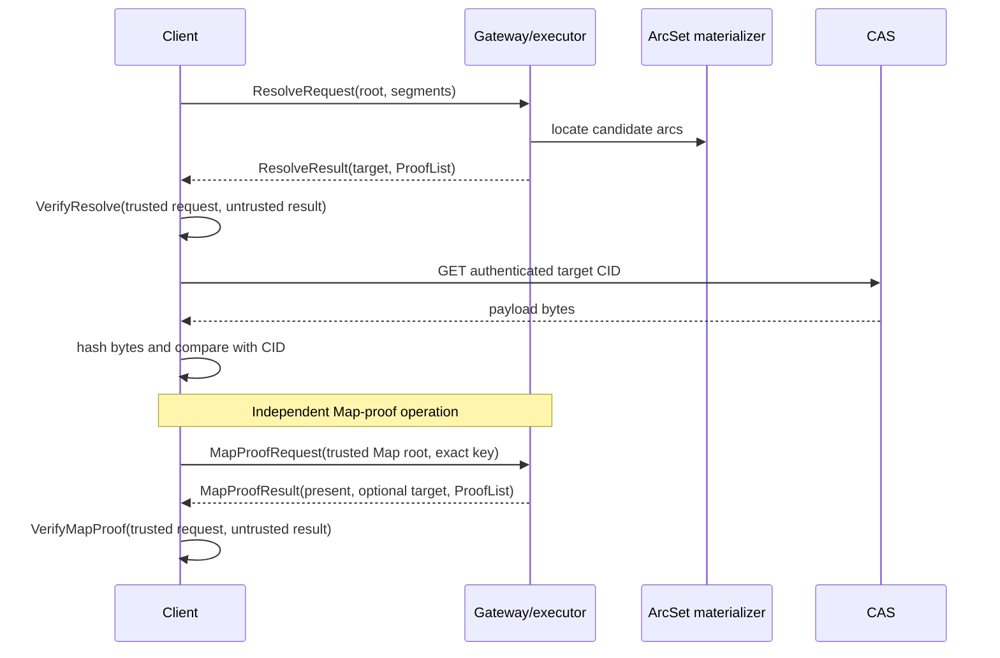

# MALT Core Architecture

## Purpose

This repository implements the protocol and algorithms required to produce and
verify arc-granularity graph authentication evidence. It is an SDK, not a
node, filesystem, object store, gateway product, or client application.

Correctness is rooted in a caller-selected root CID and local verification of
an operation-specific request/result pair. ArcTable, CAS, transport, cache, and
application state are outside the trust boundary.

## Responsibility model

| Layer | Owns | Explicitly excludes |
| --- | --- | --- |
| MALT core | arcs/segments, typed roots, commitments, resolve/read/Map-proof/mutation and client-root values, ProofList, verification | HTTP, CAS I/O, ArcTable implementation, application syntax, trusted-root policy |
| Client | application syntax, accepted roots, request construction, local proof and payload-byte verification, optional client-root computation | proof generation, persistent ArcTable, server policy |
| Gateway/executor | candidate selection for server-executed mutations, exact client-root replay/materialization, proof generation, ArcTable/KV/CAS, service policy | the final trust decision or substitution of a client-computed root |
| CAS | immutable CID-addressed bytes | graph semantics and ProofLists |

## Repository boundary

The source repository and Go module for this SDK are
`DeWebProtocol/malt-core` and `github.com/dewebprotocol/malt-core`. The wider
system keeps the following one-way dependencies:

```text
MALT local runtime ──► malt-core
managed Gateway   ──► malt-core
malt-evaluation   ──► pinned malt-core and product artifacts
malt-web          ──► versioned browser-verifier artifacts
```

The local runtime owns trusted roots, keys, UnixFS, synchronization, local
filesystem projection, and pluggable Gateway/peer/local transports. The
Gateway is an optional untrusted executor and storage provider. Neither may be
imported by this module.

## Data flow



The gateway may return any complete valid derivation. If multiple derivations
exist, MALT does not require a proof of maximality, uniqueness, or longest-prefix
selection. Application policy may impose additional constraints.

## Package layers

```text
malt (module facade)
├── protocol                 serialized resolve/read/Map-proof and client-root profiles
├── mutation                 portable mutation/client-root/receipt values
├── auth
│   ├── arcset               canonical arcs and ArcSet views
│   │   └── materializer     caller-injected load/store capability
│   ├── commitment           KZG/IPA commitment primitives
│   ├── observation          optional request-scoped diagnostics
│   ├── semantic             map/list contracts and algorithms
│   ├── proof                ProofList and evidence
│   └── verifier             storage-free portable verifier
├── execution                untrusted operation composition
├── graph                    resolver/writer algorithms
│   └── runtime              composition over an injected materializer
├── sdk/verifier             trusted client facade
├── sdk/writer               complete-view client-root computation
├── cmd/malt-verifier-wasm   browser verification adapter
├── cmd/malt-writer-wasm     browser client-root adapter
├── wire/maltcid             typed CID rules
└── artifact                 frozen compatibility profile
```

`graph/runtime` means an in-process algorithm composition. It owns no process
lifecycle, HTTP route, KV database, ArcTable implementation, CAS backend, or
authoritative root.

## ArcSet and materialization

`auth/arcset` is the canonical in-memory/traversable representation used by
core algorithms. Proof generation also needs to load internal commitment nodes
and root-relative ArcSet views. The SDK therefore accepts small injected
capabilities:

```go
type Lookup interface {
    Get(context.Context, string, cid.Cid, arcset.Path) (cid.Cid, error)
    BatchGet(context.Context, string, cid.Cid, []arcset.Path) (map[arcset.Path]cid.Cid, error)
}

type Updater interface {
    Update(context.Context, string, cid.Cid, cid.Cid, arcset.ArcSet) error
}

type Snapshotter interface {
    Snapshot(context.Context, string, cid.Cid) (arcset.ArcSet, error)
}
```

`NodeStore` composes `Lookup + Updater`; `MutableStore` adds `Snapshotter`.
The full compatibility `Store` additionally supports iteration. These
interfaces describe algorithmic capability only. They do not define:

- ArcTable key formats or version chains;
- KV/SQL/object-store persistence;
- transactions or distributed consistency;
- namespace ownership or tenant meaning;
- cache, Bloom filter, GC, or lifecycle policy.

The gateway repository supplies the current persistent ArcTable/KV
implementation. Portable verification does not import `materializer`.

## Operation contracts

### Resolve

`ResolveRequest` contains a caller-selected root and segment array.
`ResolveResult` contains the target and ProofList. The executor may group
multiple segments into one canonical arc during longest-prefix discovery.
`VerifyResolve` proves the returned complete derivation against the request.

### Read

`ReadRequest` performs one typed primitive operation: `map_key`, `list_index`,
or `list_range`. `ReadResult` contains the target, optional authenticated range
segment CIDs, and ProofList. `VerifyRead` binds the evidence to the exact
caller-selected query.

### Map proof

`MapProofRequest` contains a caller-selected trusted Map root and exact
canonical key. `MapProofResult` is untrusted and contains `present`, a
target if and only if the relation is present, and a root-bound ProofList.
`execution.Executor.ProveMap` may generate either membership or
non-membership evidence without changing `Read`'s `ErrQueryNotFound`
behavior. `VerifyMapProof` requires exactly one proof step and binds the
ProofList root, query/path, presence state, optional target, step kind, and
cryptographic evidence to the request.

Non-membership authenticates only the absence of that one exact keyed Map
relation. It does not prove List-index, graph-path, object, payload-byte, or
remote-data absence.

Resolve and Read generate their operation-specific evidence during execution.
Map membership and non-membership use the dedicated Map-proof operation; there
is no generic `prove` union. `malt.artifact/v0alpha2` remains frozen
compatibility data.

### Apply

`mutation` defines namespace-free semantic mutation values. `execution.Executor`
can apply them through an injected writer and returns an operational receipt.
The receipt is not a cryptographic state-transition proof. A returned root is a
candidate until the client accepts it under its own publication/freshness
policy.

`RuntimeGraph.Writer()` exposes only `MutationWriter`. Bootstrap creation is a
separate `StructureCreator` because a new structure has no authenticated base
root. Legacy `UpdateArc`, `BatchUpdateArcs`, and inspection helpers are exposed
only through the explicitly named `ReferenceWriter()` capability.

### Client-root computation

The experimental client-root contract included in v0.0.7-rc.1 lets a trusted
writer validate a bounded, untrusted complete `UpdateView`, normalize an
output-free `SemanticIntent`, and compute one exact `ClientRootBundle`
locally. Its `/v1` profile suffixes version experimental serialized contracts
and do not declare stable MALT or Go source APIs. `sdk/writer` owns that
application-neutral computation. It uses caller-supplied branching
materialization only for speculative local state and defines no durable
ArcTable or publication policy.

`cmd/malt-writer-wasm` exposes the same exact computation to browsers through
`maltComputeClientRootV1`. It accepts the existing checked client-root wire
profiles as bounded UTF-8 JSON `Uint8Array` values and performs no network,
publication, persistence, or trust action.

A service may independently replay and materialize the exact bundle at its
declared durability boundary, then acknowledge it with a
`MaterializationReceipt`. That receipt can advance a writer session's retained
vectors, but it is not a portable state-transition, freshness, publication, or
trust proof. Initial structure creation remains a separate bootstrap boundary
because it has no authenticated base root. See the
[client-root contract](./docs/spec/client-root-contract.md).

## Verification boundary

Trusted verification packages must remain deterministic and storage-free:

- `auth/verifier` verifies ProofList evidence;
- module-root `VerifyResolve`, `VerifyRead`, and `VerifyMapProof` bind
  caller-selected operation inputs to untrusted results and ProofLists;
- `sdk/verifier` exposes the local Go facade for those operations;
- `cmd/malt-verifier-wasm` exposes the same Go verification boundary through
  `maltVerifyResolve`, `maltVerifyRead`, and `maltVerifyMapProof`.

They do not call a gateway, remote verifier, CAS, ArcTable, filesystem, or
network. Remote verify endpoints are diagnostics only.

For present relations, proof verification authenticates a target CID, not
arbitrary response bytes. Successful Map non-membership verification instead
authenticates only absence of the exact requested keyed relation and carries
no target. A consuming client must still bind any returned payload bytes to
authenticated CIDs.

## Application boundary

UnixFS is not a core layout or package. It is a client application profile that
maps filesystem paths/manifests/chunks into core segment, mutation, resolve,
and read contracts. Its native implementation lives in `malt-client`; the
managed browser application lives in `gateway/console`.

`auth/observation` is an application-neutral, request-scoped diagnostic hook
used by outer runtimes and evaluators. Observations cannot affect protocol
results and are never proof evidence. Its current phase vocabulary describes
SDK execution stages, not a paper result schema or persistence contract.

A future TypeScript SDK may map `.` or `[]` object syntax into the same segment
arrays. Core does not parse those syntaxes. HTTP may naturally use `/`, while
RPC may transmit the array directly.

## Import guards

`architecture_test.go` enforces the trusted-layer dependency direction. In
particular, the module facade, portable mutation values, artifact compatibility
layer, and client verifier cannot import server, storage, application, or
runtime process packages. Removed product packages must not be reintroduced to
this module.
